# SPARC Phase 3: Architecture Diagrams

## System Context Diagram

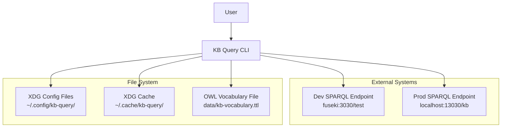

## Component Interaction Diagram

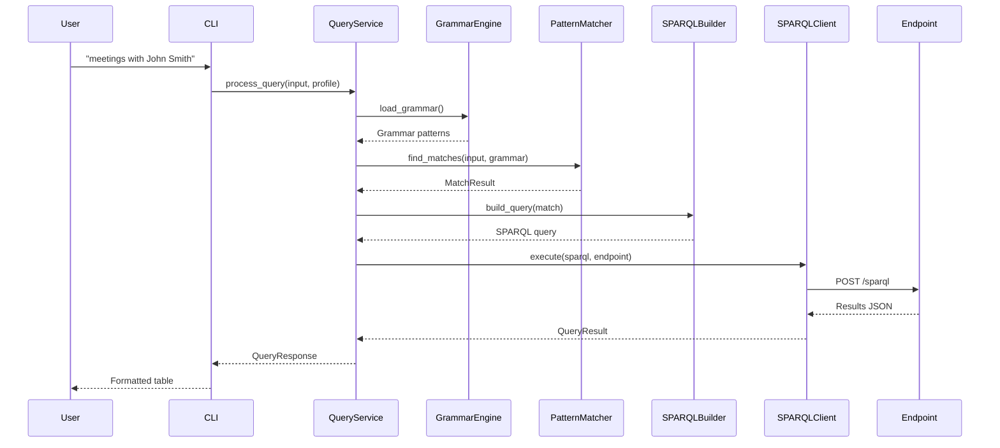

## Layer Architecture Diagram

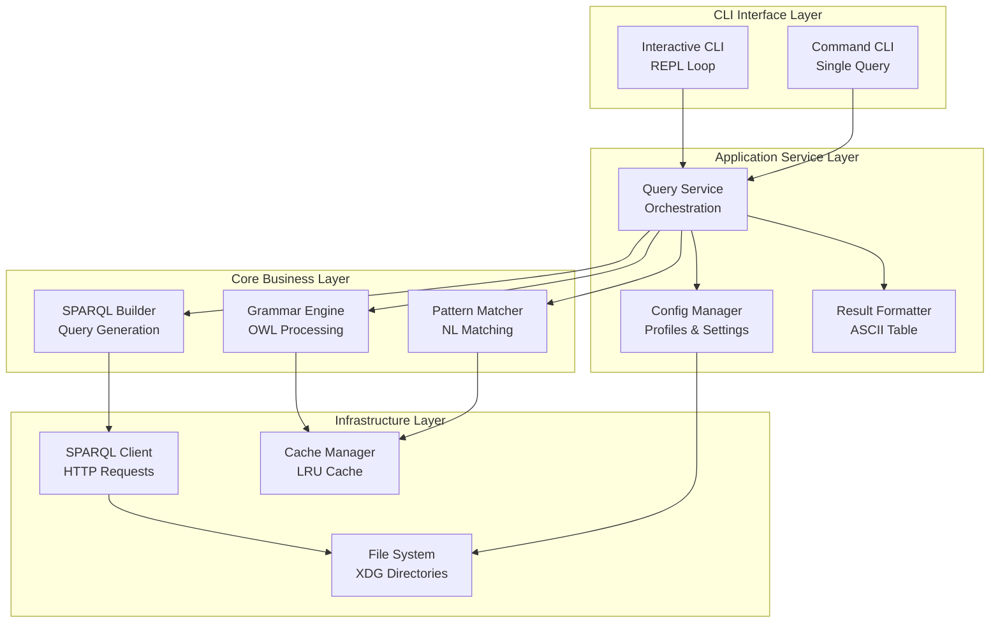

## Data Flow Diagram

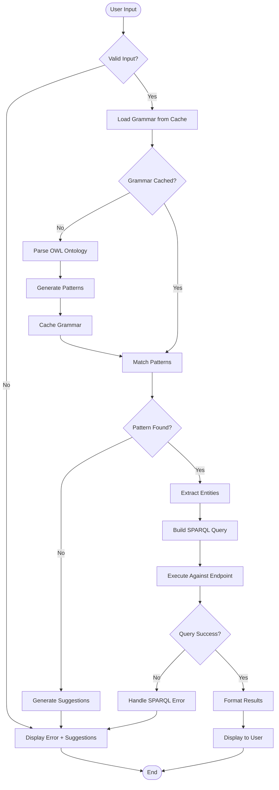

## Component Dependency Graph

```mermaid
graph LR
    CLI[CLI Components] --> Services[Service Layer]
    Services --> Core[Core Business Logic]
    Core --> Infrastructure[Infrastructure Layer]
    
    subgraph CLI
        direction TB
        InteractiveCLI
        CommandCLI
        ArgumentParser
    end
    
    subgraph Services
        direction TB
        QueryService
        ConfigManager
        SuggestionService
    end
    
    subgraph Core
        direction TB
        GrammarEngine
        PatternMatcher
        SPARQLBuilder
        EntityExtractor
    end
    
    subgraph Infrastructure
        direction TB
        SPARQLClient
        CacheManager
        FileSystemManager
        CredentialManager
    end
```

## State Transition Diagram (Interactive Mode)

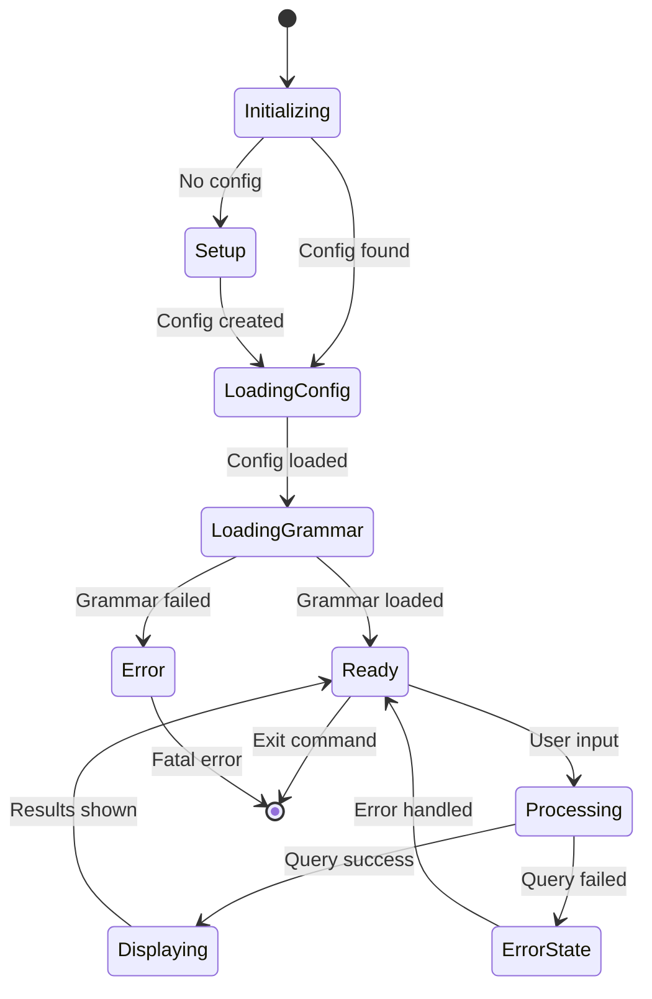

## Error Handling Flow

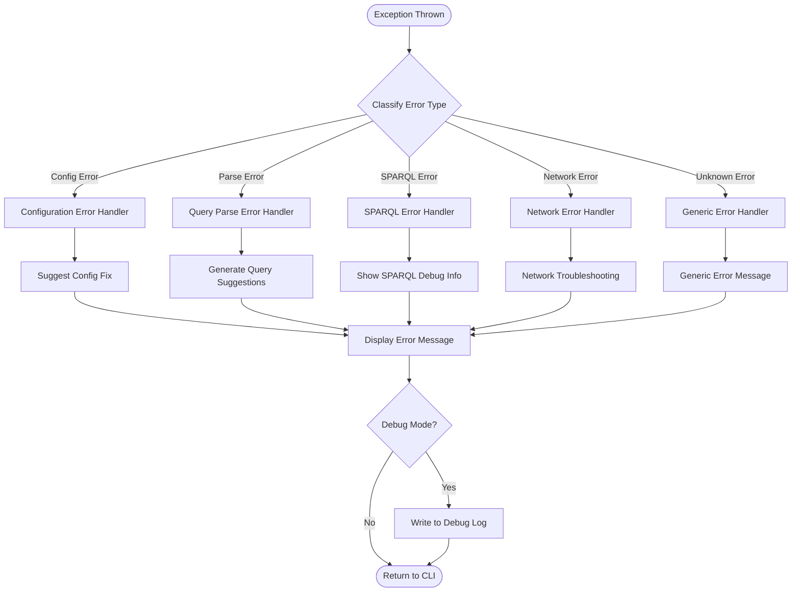

## Cache Architecture

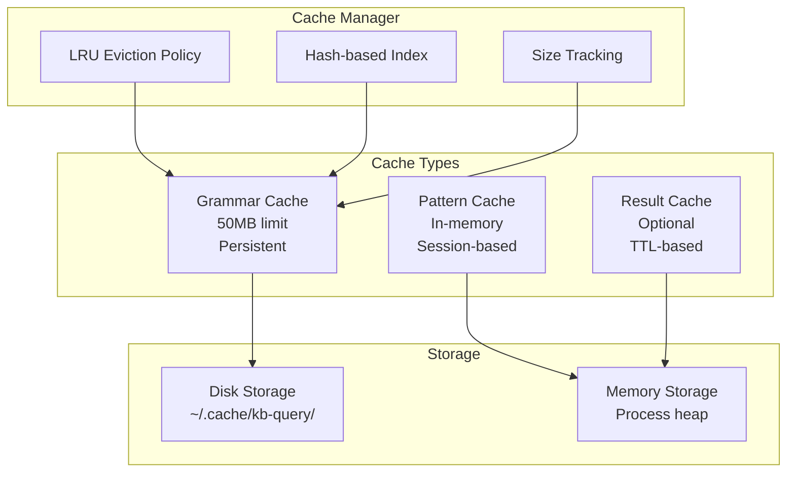

## Security Architecture

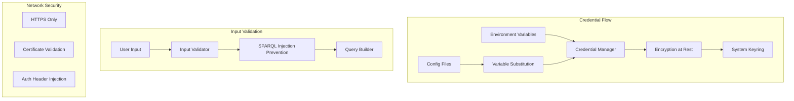

## Testing Architecture

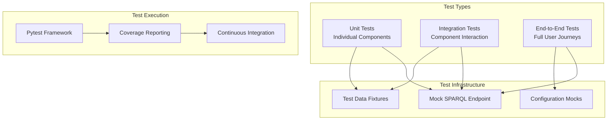

## Deployment Architecture

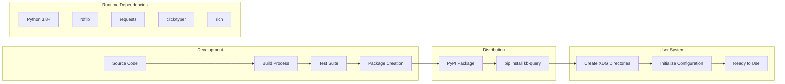

## Performance Monitoring

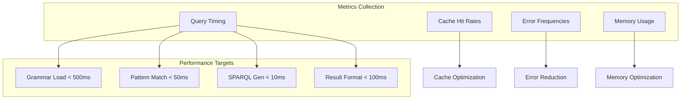